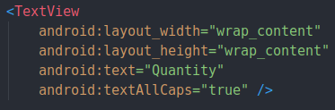
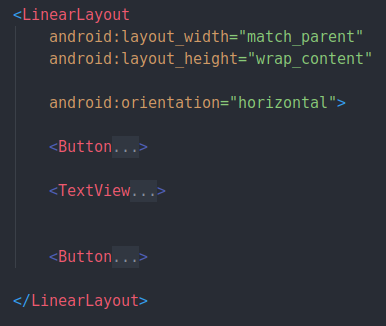
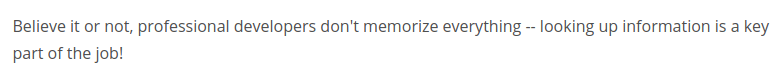

# 3. XML Syntax
Created Saturday 24 October 2020

Rules for valid XML

* A tag must have a closing tag. Tags with no(enclosing) content are self-closing.
* Tags can be nested.
* Tags have attributes and values(strings).

Examples

