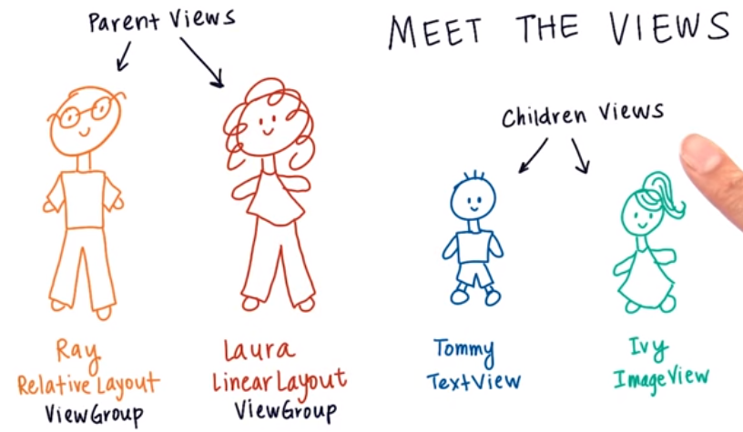
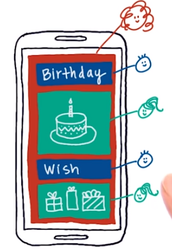
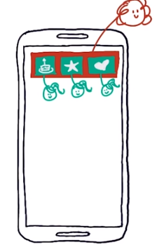
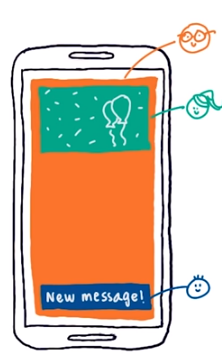
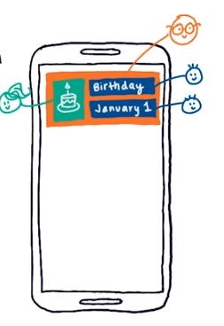
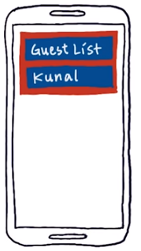
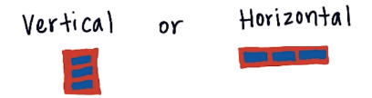

# 1. View groups
Created Saturday 24 October 2020

* A view group just a view. 
* It is supposed to be the container for other views.
* It is invisible and rectangular, just like any other view.

* View groups are also called parent views.
* A view group can control the children inside it, using some rules.

*****

There are two types of view groups:

1. **LinearLayout** - Children views are arranged as an array(i.e as rows or columns).

  

2. **RelativeLayout** - Children are arranged with respect to the parent and/or siblings.

 

*****

#### XML Syntax for LinearLayout
	<LinearLayout
	    android:layout_height="wrap_content"
	    android:layout_width="wrap_content"
	    android:orientation="vertical">
	
	    <TextView
	        android:layout_height="wrap_content"
	        android:layout_width="wrap_content"
	        android:text="Guest List" />
	    <TextView android:text="Kunal" />
	<LinearLayout />

Note - In this picture, background colors have been added for clarity, code for them is actually absent.

*****

* View groups are have an explicit closing bracket, because they have the child views as content.
* The mode for LinearLayout is set using ``orientation`` = ``vertical`` or ``horizontal``(the default).

