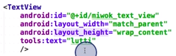

# 2. XML namespace declaration
Created Saturday 24 October 2020

#### Namespace
A namespace contains information about the attributes and their allowed values.

* The most common is ``android``

	<LinearLayout 
		xmlns:android="http://schemas.android.com/apk/res/android" 
		android:layout_height="500dp"
		>
	<LinearLayout/>

#### Syntax for namespaces

* Declaration of namespace

``xlmns:android="namespace_location_or_URL"``

* Using the namespace anywhere inside the tag.

``android:``**``attribute``**``="value"``

Note: Double quotes are necessary for values.

*****

There are other namespaces, like ``tools``

* Namespaces are usually declared in the root tag where the attributes will be used inside.

	<RootTag xmlns:android="http://schemas.android.com/apk/res/android"
	xmlns:tools="http://schemas.android.com/tools" >

#### Design Time attributes
These are attributes that are for preview in Android Studio, i.e they don't show up at runtime.

* ``android:text`` is different from this. It is still accessible.

