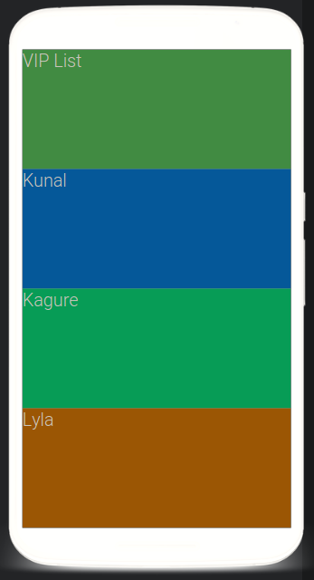
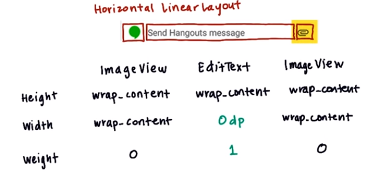
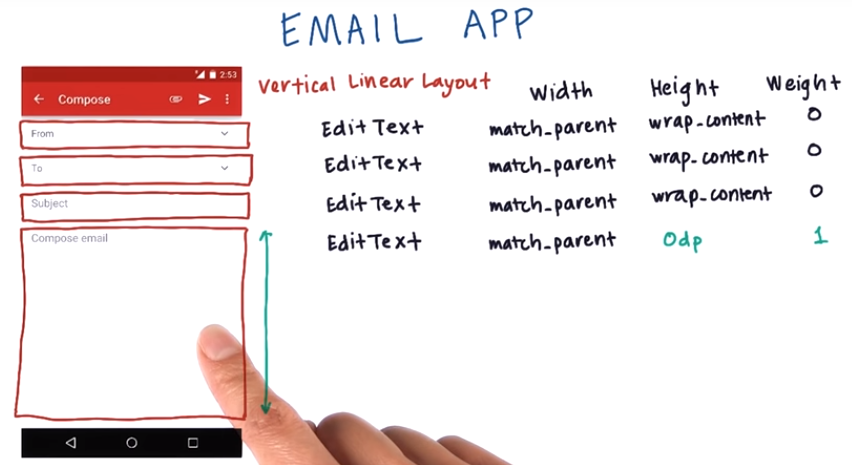

# 4. layout weight
Created Saturday 24 October 2020

Suppose we have a linear layout(vertical orientation), and we want to fill it completely with four TextViews such each takes up the same space as others.
Approaches:

1. hard code(dp) - does **not** work for all devices.
2. ``wrap_content`` - does **not** fill the view completely.
3. ``match_parent`` - the first TextView will take up all space.

* We are out of options.

*****

We need the concept of **weight** here.

* All views(children) that need weight are assigned a *__non-zero__* ``layout_weight`` value, and the relevant(the one being set) dimension is set to **zero**(this is compulsory).
* A child with no weight attribute has a default weight of zero. Dimensions for such a view must be specified. It can be though of as a non-participating child.
* layout_weights determine the sharing ratio of the remaining screen real estate, i.e *after* placing all the non-participating children.

*****

Syntax: This attribute is set for children only. The parent remains untouched.
Steps:

1. Set the ratios(integral)
2. Set the participating children dimensions to zero(because dimensions are mandatory).

Note: 

* If all ratios are the same, it is the same as 1:1:1....
* If there's only one participating child, then weight does not matter, because it will fill up the whole(remaining) space.
* If a participating child has a dimension set to non-zero, it does not affect anything. But doing this is discouraged.
* layout_weight works only for a LinearLayout.

*****

**Example**
	<LinearLayout
	    xmlns:android="http://schemas.android.com/apk/res/android"
	    android:orientation="vertical"
	    android:layout_width="match_parent"
	    android:layout_height="match_parent"
	    android:background="@android:color/darker_gray">
	
	    <TextView
	        android:text="VIP List"
	        android:layout_width="wrap_content"
	        android:layout_weight="1"
	           android:layout_height="10dp"
	        android:background="#4CAF50"
	        android:textSize="24sp" />
	
	    <TextView
	        android:text="Kunal"
	        android:layout_width="wrap_content"
	       android:layout_weight="1"
	           android:layout_height="0dp"
	        android:background="#4CAFFF"
	        android:textSize="24sp" />
	
	    <TextView
	        android:text="Kagure"
	        android:layout_width="wrap_content"
	        android:layout_weight="1"
	           android:layout_height="0dp"
	        android:background="#4CFF90"
	        android:textSize="24sp" />
	
	    <TextView
	        android:text="Lyla"
	        android:layout_width="wrap_content"
	        android:layout_height="0dp"
	      android:layout_weight="1"
	        android:background="#FFAF50"
	        android:textSize="24sp" />
	
	</LinearLayout>

*****

How do weights work?

* Initially, the non-participating children(which have non-zero dimensions) are placed on the screen. The remaining(weighted children) are flat(because we set them to 0dp).
* The remaining space is then divided amongst the flat views, inflating them in the process.

*****

**Example - 1**

How can we make this?

* We want the icons to be of fixed sizes, and the EditText to expand/shrink on different devices.
* Set ``layout_height`` to ``wrap_content``, for all views.
* Set ``layout_width`` to ``wrap_content`` for the icons.
* For the EditText, set **layout_weight** as 1 and ``layout_width``=0dp.
* This way our EditText can resize on all devices.

**Solution**

**Example - 2**

**Example - 3**

* Weights are for managing space dynamically inside a LinearLayout.

