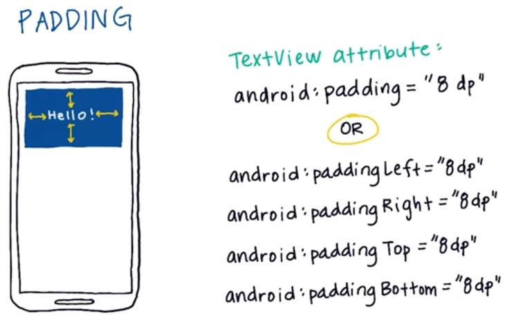
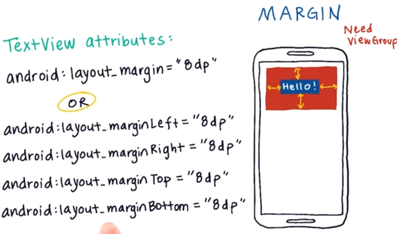
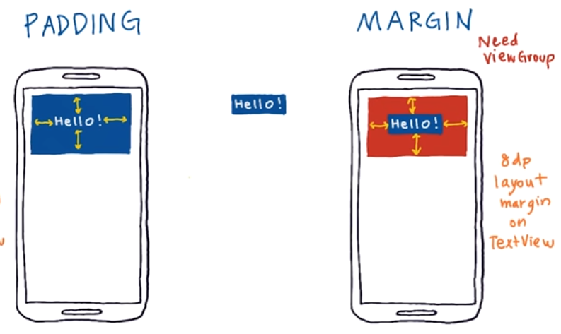

# 6. Padding and Margin
Created Sunday 25 October 2020

* We need to have some whitepace, to avoid overcrowding.

#### Padding
Whitespace between content(inside) and the border of the view.

* If padding is set, all 4 directions also get the same value, unless they are individually set.
* By default, padding is zero for all directions.

#### Margin
Whitespace outside the border of the view. Like a force field!

* If padding is set, all 4 directions also get the same value, unless they are set indvidually.
* Note the layout_, because we are changing the 'outside' of the view, not the content.

*****

**Question **- Is the choice between padding and margin irrelevant, if the display looks identical when either is used.
**Answer** - No, margin and padding are fundamentally different. They may "look" identical. This can be demonstrated by setting the background color of the view group and the child. In case of padding, the child will be enlarged to accomodate pad the text inside. If margin is used, the parent enlarges itself due to the margin.

Note:

* Padding attributes don't start with ``layout_``, because padding changes the content inside the view.
* Margin attributes start with ``layout_`` because margin does not affect the content. It only affects outside of the view.

