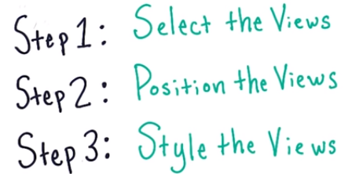
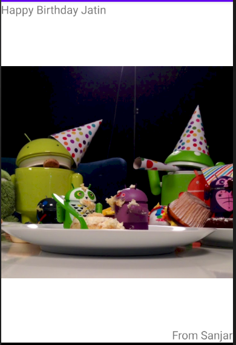
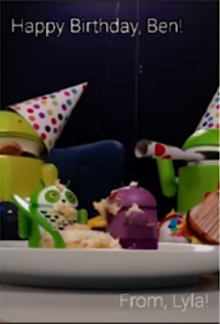
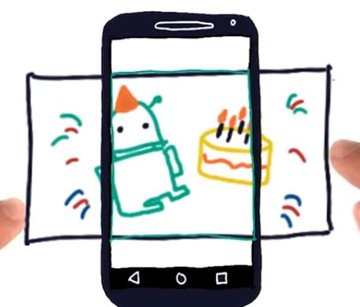

# 3. Birthday Card App
Created Monday 26 October 2020

* Similar to a webpage, first the skeleton, then the stylistic elements.

* We first copy the image into the res/drawable folder. The image is accessed using ``android:src="@drawable/androidparty"``
* We use a ``RelativeLayout``, and add the image and texts.

	<RelativeLayout xmlns:android="http://schemas.android.com/apk/res/android"
	    xmlns:tools="http://schemas.android.com/tools"
	    android:layout_width="match_parent"
	    android:layout_height="match_parent"
	    tools:context=".MainActivity">
	
	    <ImageView
	        android:layout_width="match_parent"
	        android:layout_height="match_parent"
	        android:src="@drawable/androidparty"
	        android:layout_centerHorizontal="true"
	        android:layout_centerVertical="true"/>
	
	    <TextView
	        android:layout_width="wrap_content"
	        android:layout_height="wrap_content"
	        android:text="Happy Birthday Jatin"
	        android:textSize="20sp"/>
	    <TextView
	        android:layout_alignParentBottom="true"
	        android:layout_alignParentRight="true"
	        android:layout_width="wrap_content"
	        android:layout_height="wrap_content"
	        android:text="From Sanjar"
	        android:textSize="20sp"/>
	</RelativeLayout>

Result

*****

* Our goal is this

Things to be done:

* Make the text larger, set textColor, fontFamily etc. Note than if a font is not available for an old Android version, the font falls back to the default.
* Stretching the image - We use the 'scaleType' attribute. It can take many values, but we'll look at two important ones:
	1. center - centers the image.
	2. centerCrop - Scales uniformly till the min(new_width, new_height) is >= min(width, height) - padding, then crops off the image and places it to the center.

*****

17. We need to add some space around the text - What to use? padding or layout_margin
18. Both look the same, but are different. And don't apply both!

