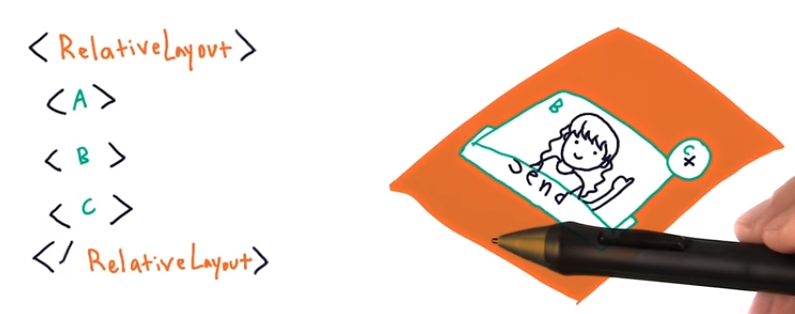
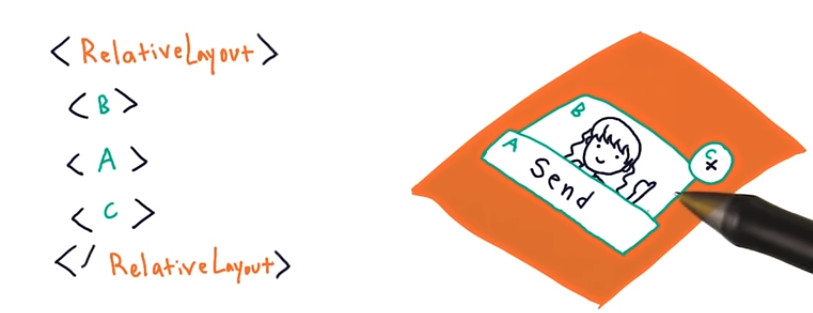

# 4. Overlapping Views
Created Monday 26 October 2020

* Ordering of views in the XML code(top-down and nesting) determines the overlap order. 
* The first one(i.e in code) is at the bottom.
* This can be seen in a ``RelativeLayout``.

 

