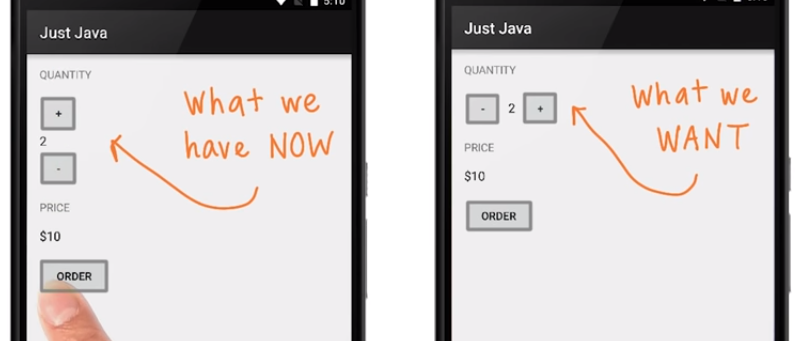

# 1. Changing the layout
Created Friday 30 October 2020

Steps to achieve this:

* Wrap the three field, i.e '+',  quantityText and '-' into a horizontal LinearLayout.
* Change the vertical margins and give the text a pading on the left and right.

	<?xml version="1.0" encoding="utf-8"?>
	<RelativeLayout xmlns:android="http://schemas.android.com/apk/res/android"
	    android:layout_width="match_parent"
	    android:layout_height="match_parent">
	
	    <LinearLayout
	        android:layout_width="match_parent"
	        android:layout_height="wrap_content"
	        android:orientation="vertical"
	        android:padding="16dp">
	
	        <TextView
	            android:layout_width="wrap_content"
	            android:layout_height="wrap_content"
	            android:text="Quantity"
	            android:textAllCaps="true" />
	
	        <LinearLayout
	            android:layout_width="wrap_content"
	            android:layout_height="wrap_content"
	
	            android:orientation="horizontal">
	
	            <Button
	                android:id="@+id/decrement_button"
	                android:layout_width="48dp"
	                android:layout_height="48dp"
	                android:onClick="decrement"
	                android:text="-"
	                android:tooltipText="Remove a cup" />
	
	            <TextView
	                android:id="@+id/quantity_text_view"
	                android:layout_width="wrap_content"
	                android:layout_height="wrap_content"
	                android:paddingLeft="16dp"
	                android:paddingRight="16dp"
	                android:text="0"
	                android:textColor="@color/black"
	                android:textSize="16sp" />
	
	
	            <Button
	                android:id="@+id/increment_button"
	                android:layout_width="48dp"
	                android:layout_height="48dp"
	                android:onClick="increment"
	                android:text="+"
	                android:tooltipText="Add another cup" />
	
	        </LinearLayout>
	
	        <TextView
	            android:layout_width="wrap_content"
	            android:layout_height="wrap_content"
	            android:text="price"
	            android:textAllCaps="true" />
	
	        <TextView
	            android:id="@+id/price_text_view"
	            android:layout_width="wrap_content"
	            android:layout_height="wrap_content"
	            android:paddingTop="16dp"
	            android:paddingBottom="16dp"
	            android:text="$0"
	            android:textColor="@color/black"
	            android:textSize="16sp" />
	
	        <Button
	            android:layout_width="wrap_content"
	            android:layout_height="wrap_content"
	            android:onClick="submitOrder"
	            android:text="Order"
	            android:tooltipText="Submit your order" />
	    </LinearLayout>
	</RelativeLayout>

