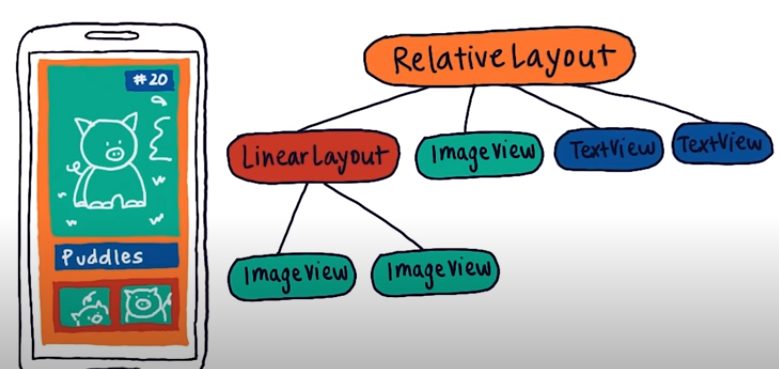
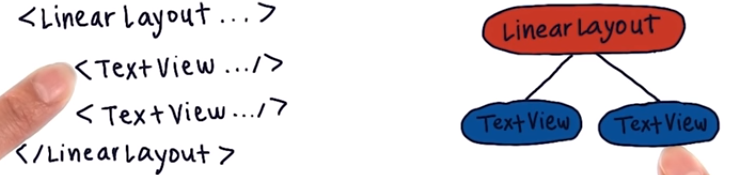
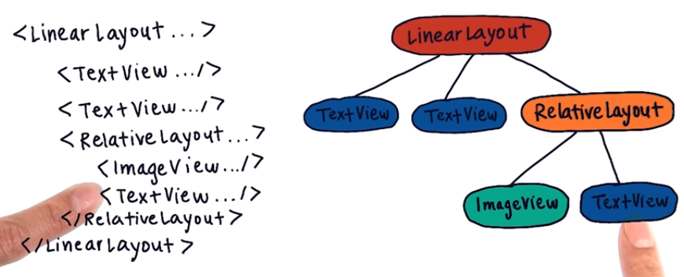

# 2. Nested Viewgroups
Created Friday 30 October 2020

We can nest views.
We have learnt about LinearLayout and RelativeLayout, but there are others as well.

Hierarchy tree for views - It is a tree representing hierarchy of the views in the screen(i.e in the root layout).

* Simple thing, nothing special.

