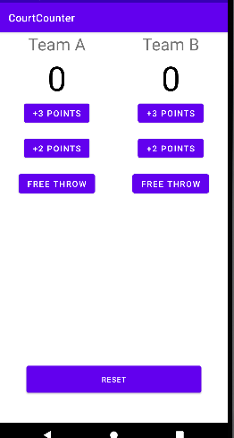

# 1. Making the layout
Created Sunday 01 November 2020

We need app which looks like this:

To make this, we follow the usual steps:

1. Select the views
2. Position the views
3. Style the views

*****

We first divide the root layout into 4 components:

1. Team name(wrap content width)
2. Team score(wrap content width)
3. Buttons(weight=1)
4. Reset button

XML code: [../../_App_3/app/src/main/res/layout/activity_main.xml](../_App_3/app/src/main/res/layout/activity_main.xml)
Java Code: [../../_App_3/app/src/main/java/com/example/android/courtcounter/MainActivity.java](../_App_3/app/src/main/java/com/example/android/courtcounter/MainActivity.java)

*****

We have used two attributes here:

1. ``gravity`` - arranges the content *inside* a view. Works for text inside the TextView.
2. ``layout_gravity`` - arranges the view's position w.r.t the parent. This is set inside the child view.

**Note**

* Both have the same set of possible values - ``left``, ``right``, ``center``, ``center_horizontal``, ``center_vertical`` etc.
* Gravity does not work for ``RelativeLayout``, as we already have ``centerInParent`` and other stuff.

