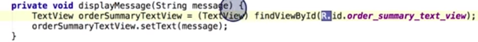

# 2. Resource IDs
Created Tuesday 03 November 2020

* Resources can be put in different folders.
* When we build our app, a tool called **aapt** generates a class file called R(a file named R.java), which contains resource IDs for all resources in the project folder.
* For each type of resource, there exists an R subclass(e.g R.drawable, R.string).

*****

Accessing resources:

1. In Java - ``R.string.hello`` - string named hello
2. In XML - A special syntax symbol similar to ``@string/hello``

Note: In the Java code, resource ids are just integers(assigned values automatically). They are not a special data type.

*****

The onCreate function is an important function in our app, which accesses the main layout file

Another example is accessing buttons/textviews etc

