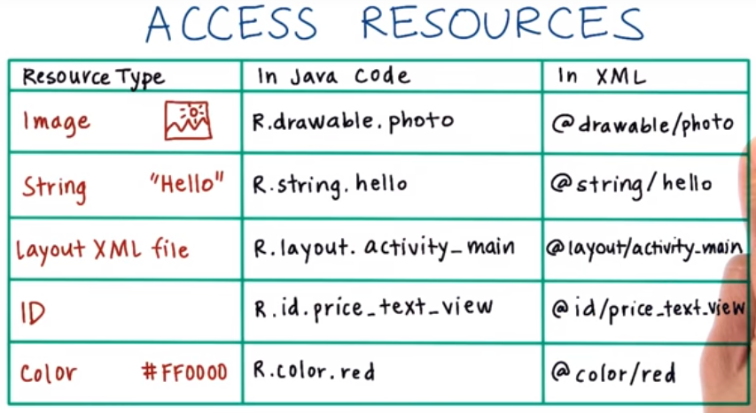
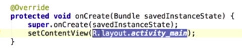

# 2. Resources
Created Tuesday 03 November 2020

* Resources are put in different folders based only on two [criteria](https://developer.android.com/guide/topics/resources/providing-resources#ResourceTypes):
	1. Resource type - string, style, image, icon, audio etc.
	2. Quality - mdpi images, hdpi images etc.

#### Readying resources

* When we build our app, a tool called **aapt** generates a class file called R(a file named ``R.java``), which contains resource IDs(i.e names) for all resources in the project folder.
* The **aapt **also creates various subclasses of resources based on ``type`` only like icons(drawable), styles, strings, colors etc. We don't need to specify quality, the OS handles it.
* This way we don't have to interact directly with the file system for resources, which is often problematic. The ``R`` class provides a systematic and dependable way to access all our resources.

Note:

* Non-media resources like styles, strings are specified in XML files. See [this](../L5_-_More_details/8._Styles.md).

#### Accessing resources

1. In Java - ``R.string.hello`` - string named hello
2. In XML - ``@string/hello``

Note: In the Java code, all resource_id(s) are actually just integers(assigned values by AAPT). This makes it very easy to work with resources.

*****

The onCreate function is an important function in our app, which accesses the main layout file

Another example is accessing buttons/textviews etc

