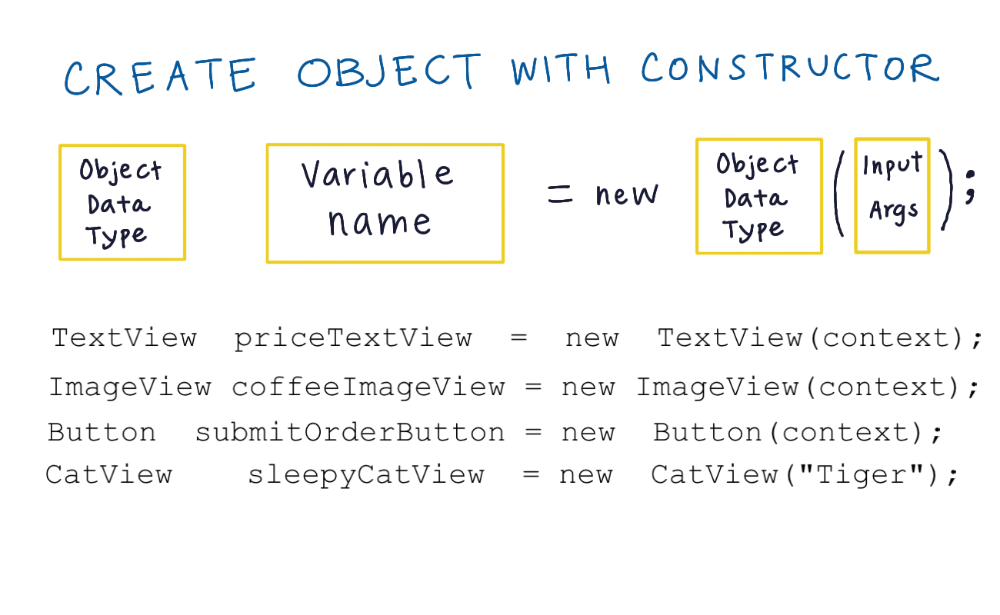
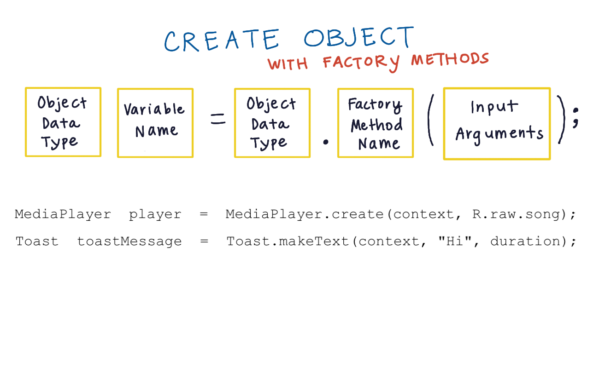

# 4. Java objects
Created Tuesday 03 November 2020

Creating objects:

1. Using the constructor

2. Using a factory method

*****

Before making a new object, do a Google search to decide which method is used for object creation.

