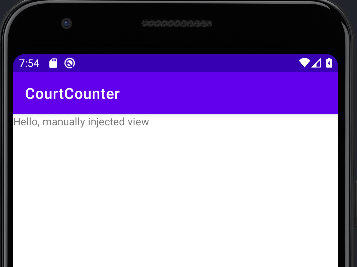
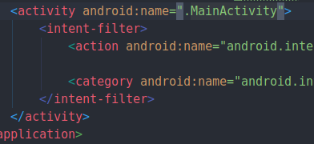

# 5. setContentView method
Created Tuesday 03 November 2020

By default the ``onCreate`` method sets the intial activity for the app.
	protected void onCreate(Bundle savedInstanceState) {
	    super.onCreate(savedInstanceState);
	    setContentView(R.layout.activity_main);
	}

But this is not necessary, we can load any activity.
If we change this to:
	protected void onCreate(Bundle savedInstanceState) {
	    super.onCreate(savedInstanceState);
	    //setContentView(R.layout.activity_main);
	    TextView tv = new TextView(this); // requires context
	    tv.setText("Hello, manually injected view");
	    setContentView(tv);  // set content
	}

This demonstrates the workflow of XML and Java.

*****

The first activity(Java file to be run) is actually specified in AndroidManifest.xml

