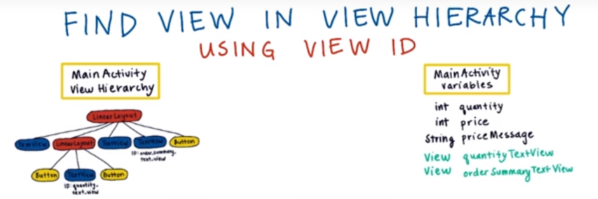
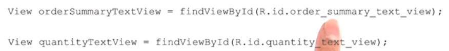

# 6. Capturing views
Created Tuesday 03 November 2020

In Android we can capture elements(views) from an activity to manipulate them.
This is done mostly using the ``findViewById`` method.

* findViewById is the method which takes the id(an int actually) as argument.
* Returns a View object. A type cast is necessary if you wish to work with the View.
* This view can now be manipulated, and the changes can be seen on the device screen.

	(TextView) findViewById(R.layout.textView1);	// explicit cast is required

Example:

Note

* ``findViewById`` is context specific. By default it searches for views only in the current activity.
* It can also be used for capturing children views.

	myViewGroup.findViewById();  // this is a view specific capture

17. How can findViewById work for both an activity and a view?
18. Because it is implemented seperately in both ``View.java`` and ``AppCompatActivity.java``.

