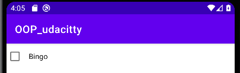
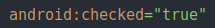
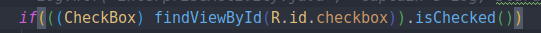
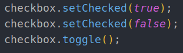

# 1. CheckBox
Created Wednesday 04 November 2020

* It is a view which can hold a boolean value, and has a label.

*****

**Syntax in XML**
	<CheckBox
	    android:layout_width="wrap_content"
	    android:layout_height="wrap_content"
	    android:checked="true"
	    android:text="Bingo"/>

* In XML, a checkbox is unchecked by default. It can set using the 'checked' field.

**Syntax in Java**

* To get the value, use **``isChecked()``**.

* To set a value, use **``setChecked(boolean value)``**.
* To toggle, use **``toggle()``**.

*****

