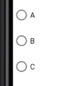

# 2. RadioGroup
Created Wednesday 04 November 2020

This is used for displaying radio buttons.

* All RadioButton(s) need to be enclosed in a RadioGroup, because they are connected.
* A RadioButton has a text field available. This text is part of the button, we don't need an extra TextView
* Every RadioButton needs to have an id - this is the only way to identify them in Android.

*****

**Syntax in XML**
	<RadioGroup
		android:layout_height="wrap_content"
		android:layout_width="wrap_content">
		<RadioButton
			android:layout_height="wrap_content"
			android:layout_width="wrap_content"
			android:text="A"/>
		<RadioButton
			android:layout_height="wrap_content"
			android:layout_width="wrap_content"
			android:text="B"/>
		<RadioButton
			android:layout_height="wrap_content"
			android:layout_width="wrap_content"
			android:text="C"/>
	<RadioGroup>

*****

**Syntax in Java**

1. Using the RadioGroup view:
	* To get the checked button - **getCheckedRadioButtonId()**. Returns the id.
	* Examine if no button is checked - use **getCheckedRadioButtonId()!=-1**
	* Set a particular button using RadioGroup view - **check(button_id)**
	* Clear all selections - **clearCheck()**
2. Using the RadioButton view:
	* Get value of a button - **isChecked()** - returns boolean
	* Set a button - **setChecked(boolean value)**
	* Toggle a button - **toggle()**

*****

Note: Avoid using the checked attribute altogether in XML, because it sets the button permanently on some API levels.

