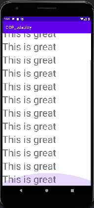
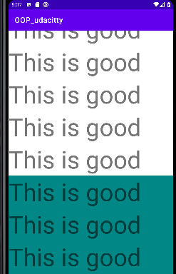

# 3. Scrolling
Created Wednesday 04 November 2020

* To make a screen scrollable, just wrap the views in a ScrollView(in XML).
* A ScrollView can contain only one root view.
* There can be multiple scroll views inside the same screen.

	<?xml version="1.0" encoding="utf-8"?>
	<ScrollView xmlns:android="http://schemas.android.com/apk/res/android"
	    android:layout_width="match_parent"
	    android:layout_height="match_parent">
		
		<!-- Root View-->
	    <LinearLayout 
	        android:layout_width="match_parent"
	        android:layout_height="match_parent">
	    </LinearLayout>
	</ScrollView>

 

