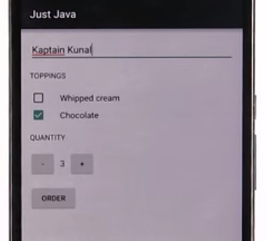
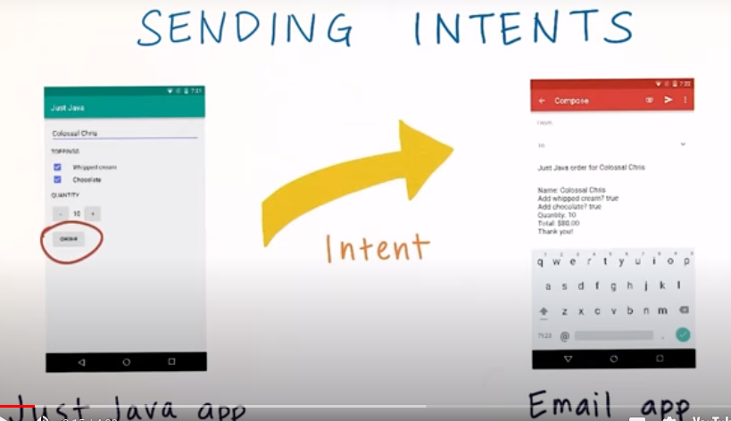
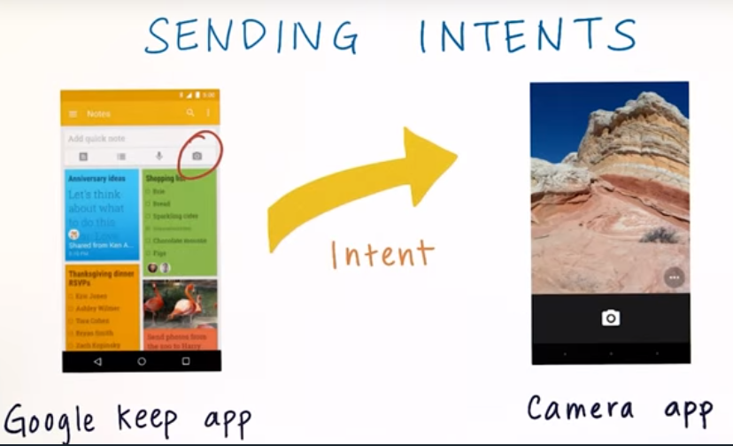
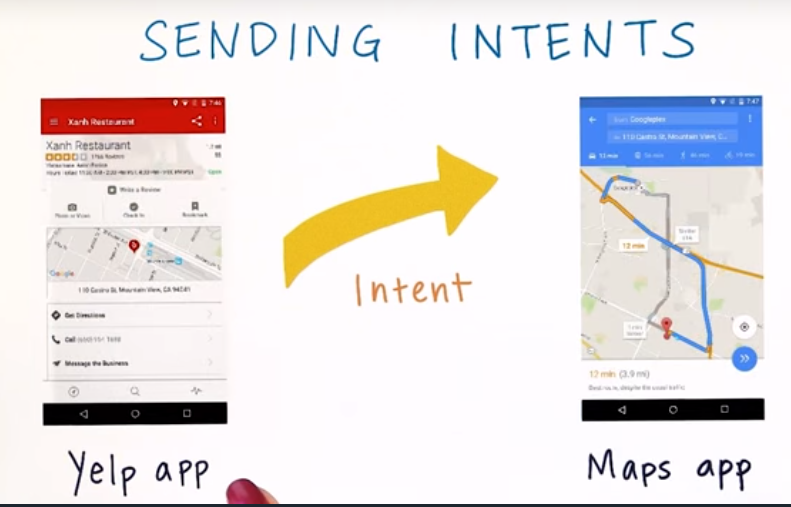
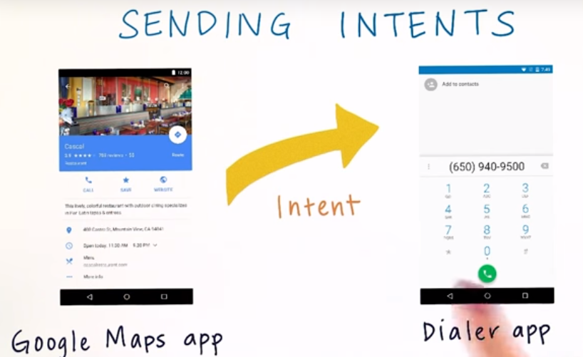
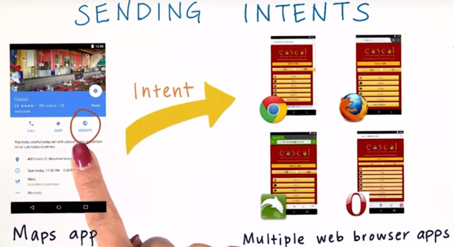
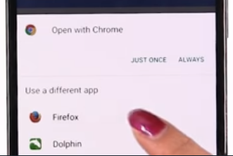
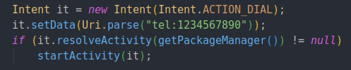
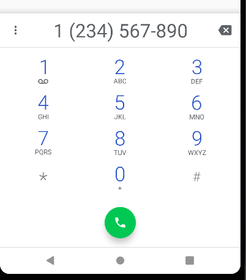

# 6. Intent
Created Wednesday 04 November 2020

We have this app, but we need to send an email when 'Order' is pressed.

There are two ways to do this:

1. Write our own email program - Impractical because there are apps which do this better.
2. Use an email app - send the summary to the app's compose activity.

This handover of data and subsequent switching over is done using intents.

* Intent is a powerful feature of the Android OS.

*****

**How Intents work**

* Intents are analogous to tossing a ball to someone(thrown to the OS), where the ball is automatically caught by a suitable person(i.e data is given to an app by the OS). 

* Intents can also be directed to a specific component of the recieving app.

Some examples of Intents
				

* The coolest part - we don't have to specify the reciever app. The OS chooses for us.

* If multiple apps which are potent, an optional view for choosing an app appears. This view is also called the disambiguation dialog. It appears only if a default app has not been configured by the user.

*****

**Anatomy of an Intent**

* There are 5 things in an Intent, but only 2 are requisite:
	1. Action - what to do - ACTION_DIAL, EMAIL, CAMERA
	2. Data URI - Data needed for action - email address, phone number, location coordinates
	3. Category - Type of recepient app - __OPTIONAL__
	4. Component - __OPTIONAL__
	5. Extras - extra information - __OPTIONAL__

		

* All this information is used by the OS select a suitable app.

*****

**How to use Intent**
Steps:

1. Create an Intent object.
2. Use **setAction()** - pass the action(actions are defined in class **Intent**). This step can be skipped by passing the action as constructor argument.
3. Use **setData()** - pass in the Data URI, using the **Uri.parse(String)** method
4. Check if an app is available - **resolveActivity(getPacketManager()) != null **
5. If true, use **startActivity(intent_obj)**

Note: 

* If action is set to ACTION_VIEW, a suitable app is selected based on the DataURI alone.
* Nothing happens if the action and DataUri mismatch. e.g setting ACTION_DIAL and a geo URI will lead to inaction.
* If there's no app to handle the Intent, it is discarded, i.e the app just ignores it and keeps running.

*****

[Common Intents Guide](http://developer.android.com/guide/components/intents-common.html?utm_source=udacity&utm_medium=course&utm_campaign=android_basics)

