# 7. Localization
Created Thursday 05 November 2020

[./_App_6](./7._Localization/_App_6)

* Localization means enabling an app to change w.r.t different locales(language, region).
* This may change our app in some ways, and the strings that appear.
* Many languages are available in Android, both symbol based(Chinese) and RTL(Arabic, Hebrew).

[Guide for Localization](https://www.youtube.com/watch?v=_b0iU2LzlUo&ab_channel=GoogleDevelopers)

*****

#### Localization overview

* Our app has default resources in the **res** directory. These default resources are in English.

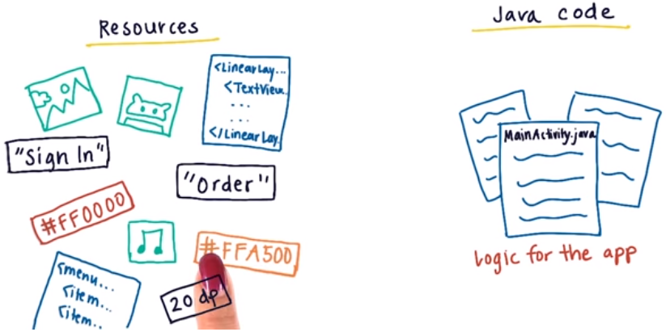

* We can also provide alternate resources based on the size, language, resolution and versions of Android. These are loaded **automatically**(awesome!!) according to system settings, i.e the developer doesn't have to mention locale specific resources in the code. 
* Language resources are used when a language is set.

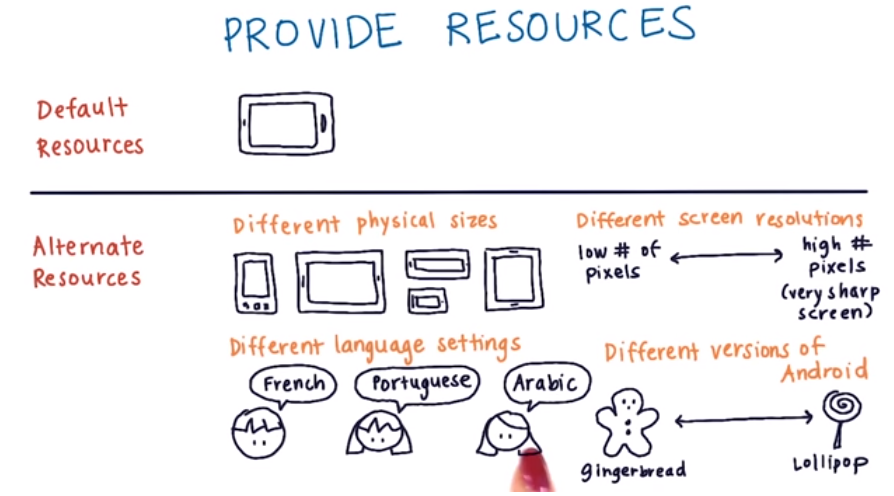

* Structure of the **res** folder

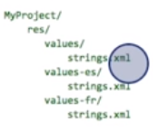

* If a specific resource is not available, the app falls back to the default one.
* Android used two letter IS code. e.g German - de, French - fr, Arabic - ar, Japanese - ja

#### Details about Localization

* We need to separate the logic of the app and the locale resources that are shown. This means using strings only from the res directory.
* Add all alternate resources like this - **dirName-fr**. e.g values-fr. These directories are on the same level as the default resource folders. The files are named the same as in the default folders.

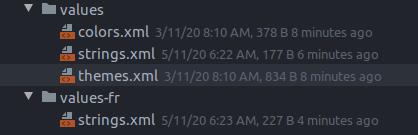

* The resource files, like XML and pictures, need to have all the tags with the same specification as the default resource tags. Only the content must change.

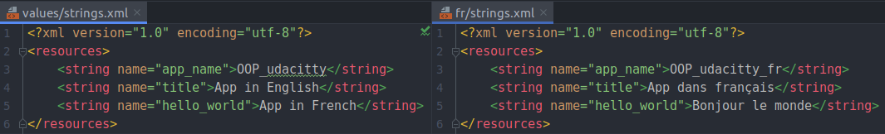

* The default XML and Java logic remain the same, even after localization.

The string ``hello_world`` here is selected automatically from the resources based on the locale.
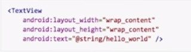 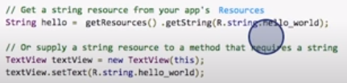 
Note: The default resources are not called 'default' explicitly. Every resource which has no locale specification is a ``default`` resource.

#### Steps for Localization

* Duplicate and rename the resource folders(values, layout etc).
* Replace the content in the files within these new directories. This means replacing all hardcoded strings by @string/string_name in XML and **getString**(R.string.string_name) in Java files. Remember, file names are not changed.

Note: All this can be done using the translator editor in Android Studio. This creates all the folders, files at the right places. Just edit the table
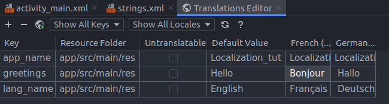

#### Precautions when localizing

1. Use place holders - To prevent lame translations. This ensures the complete sentences are translated.

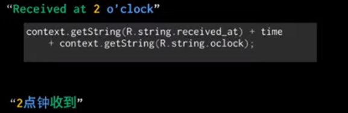 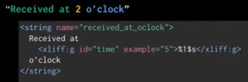

2. Provide char limit - this will help translators keep the new string under the maximum length. Prevents cut-off text.

The general rule is to add 30% extra space to UI elements to accommodate other languages. 
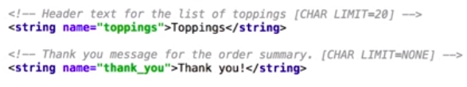

3. If a string does not need translation, set the **translation="false" **attribute.
4. Don't concatenate strings in a locale sensitive region. For a sentence containing fixed strings such as a name. Use an **xliff** tag, this ensures that the translator can change the order of words based on locale, but 'name' remains the same across all translations.

* An xliff tag has an **id **and an **example**, with place-holders(like %s for string) being used for content.
* Using xliff requires a namespace declaration.
* The Java code changes a little here, the **getString** method also needs the variable here. i.e **getString(R.string.*order_summary*, xliff_id)**. This helps in correct ordering of the words and the name in it.
* Multiple xliff tags in the same string are okay.
* This does not work - If order of multiple xliff tags(in the same string) differs for locales. Then all tags are as per default.

5. Avoid creating more resource files and text strings than you need. e.g If we need British phrases, include only the ones which are different from the default, i.e let the app fallback to default if they are the same in both langs.

