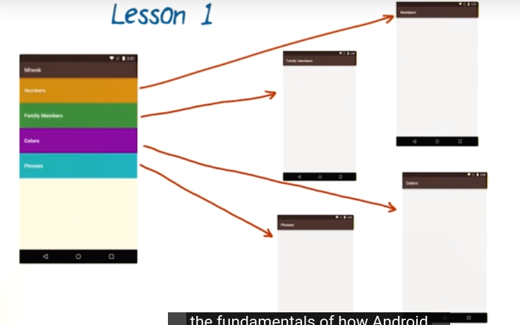
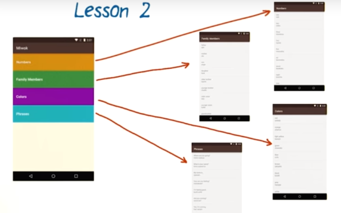
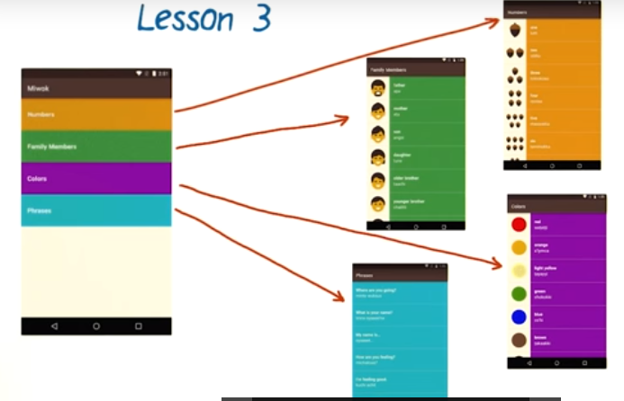
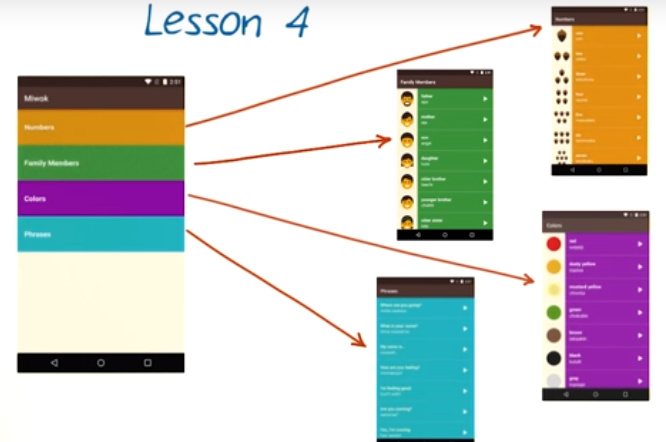
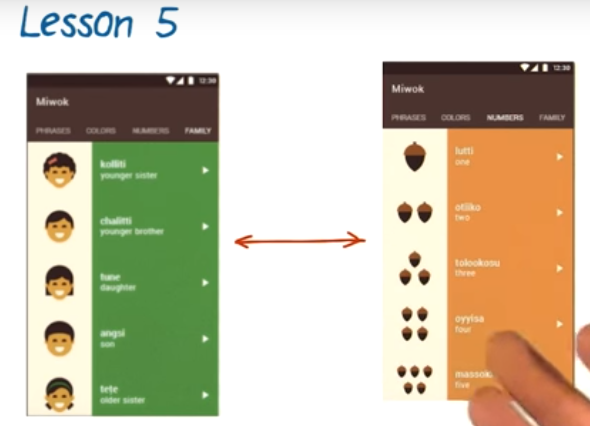

# 1. Intro
Created Wednesday 18 November 2020

In this course, we'll be building the Miwok language app in 5 stages:

1. Lesson 1
	* Show multiple screen in our app.
	* Learn how Android handles user touch events.

2. Lesson 2
	* Display a list of words.
	* Learn about data structures in Java

3. Lesson 3
	* Add images in the list for each word
	* Style the app - color, font style, spacing etc

4. Lesson 4
	* Add a 'listen' button for listening to the pronunciation for each word.
	* Learn about the media player in Android for playing MP3

5. Lesson 5
	* Integrate all lists to a single activity
	* Change the navigation flow by using Activity fragments

