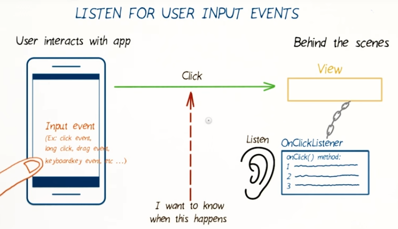
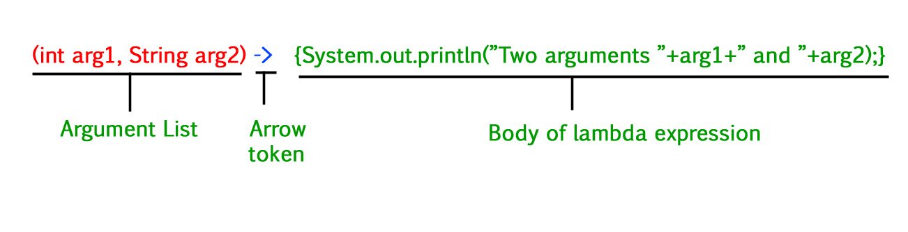
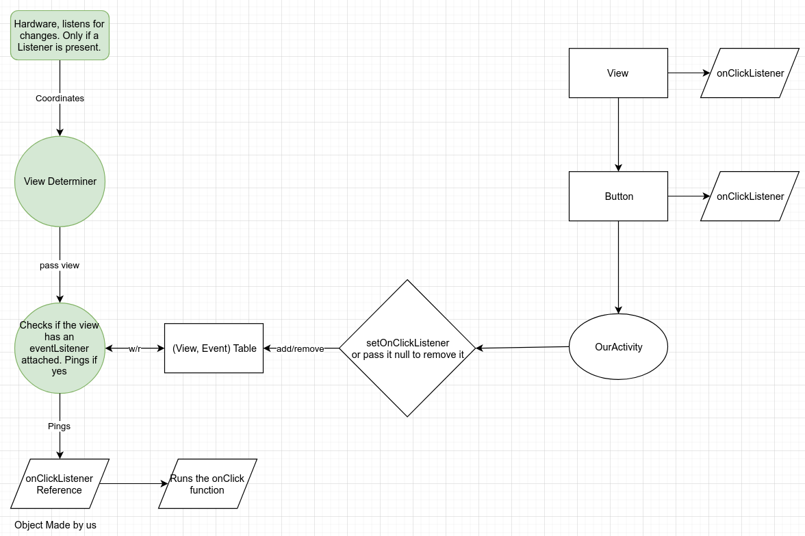

# 10. Event Listeners - Intro
Created Saturday 21 November 2020

* In all our apps so far, we've used the **android:onClick **to execute code when a view is pressed.
* Professional developers don't use **onClick** to hook up events.

#### **Why?**

* Separation of concerns, between the XML and logic(Java/Kotlin).
* We can attach/change/remove the listener at any time in the Java file.
* When you define a listener using the onClick attribute, the host view looks for the callback method only within its activity file. In contrast, programmatically setting an ``onClickListener`` allows us to control a button's behavior from anywhere within the logic files.
* Using listeners is a must when using a Fragment, which we'll learn soon.

**How does a touch event work?**
--------------------------------

* We set up an event listener on a view where we want to listen for the event.
* The user touches a view on the screen.
* Screen hardware notifies the OS that a touch event has occurred.
* The OS locates the view where the event occurred.
* This means that we are 'listening' for touch events.
* Each event listener offers a single method to be run when the event occurs, which we can add code for.
* The function is technically known as the *callback* method, aka *call after* because it is called by other code, and not by the programmer.

*****

Questions - from [here](http://developer.android.com/guide/topics/ui/ui-events.html)

1. Why have interfaces instead of functions - Because Java doesn't allow passing functions as arguments, we cannot pass the callback to the event handler. **Detour** - *Lambdas do allow this from Java 8 onwards.*
2. Why have a 'single function interface' for each type of event? - If we had multiple functions(corresponding to different kinds of events) in the same interface, we'd have to provide empty bodies(stubs) for all types of events that we don't need. This would be very impractical. To avoid this, Android uses SAM(Single Abstract Method) interfaces. **Another** reason is that in the (View, Event) table, we can have a tree data structure. This makes the lookup faster, when an event occurs.

* Better use [lambdas](https://mayojava.github.io/android/java/using-java8-lambda-expressions-in-android/) instead, syntax is similar to C++ lambdas.

*****

My understanding of Events in Java

