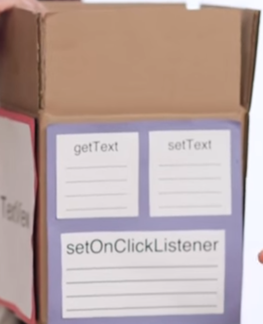
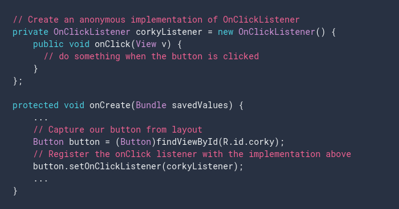
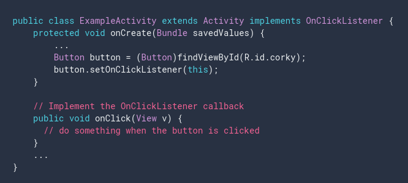
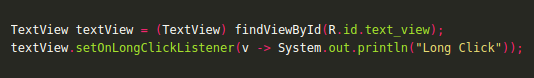

# 11. Event Listeners in Android - Details
Created Monday 23 November 2020

1. We have our view which is going to handle an event.

2. A view has many methods There's one called **setOnClickListener()** which adds an entry in the (View, Event) table.

3. This **setOnClickListener()** takes as argument an implemented object of an Interface(defined in the **View**) called **OnClickListener**.

4. This reference object has a function named **onClick()** which is executed when the event occurs.

5. We add code for **onClick** function, which we override.

There are three ways to do so:

1. By using an anoynmous class, for creating the reference of **OnClickListener**

2. By implementing the interface **OnClickListener**, and passing the current object itself as reference.

3. Use Lambda - best. Argument is the host view.

Note: 

* Except for the name, the **onClick** function is exactly the same as a custom callback function for the ``onClick`` attribute: it is **public void** and takes the host **View** as argument.

*****

This is very similar to JavaScript.
In JS we do this.
	button.addEventListener('click', function()
									{ /*code to run*/ }
	);

In Android the reference object specifies both the event and the code as a single unit. i.e we don't have to pass the event separately.
	button.setOnClickListener(new OnClickListener()
								{
									@Override
									public void onClick(View v)
									{
										/*code to run*/
									}
								}
	);
	
	// or better
	
	button.setOnClickListener(v -> System.out.println()); // Type is inferenced

Difference between JS and Android Event listeners:

1. JS has a common 'addEventListener' method for all events; Each event has its own eventSetter(**:)**) in Android.
2. JS specifies the event; Android doesn't need to because the eventSetter method specifies it.
3. JS takes in a method as argument.

