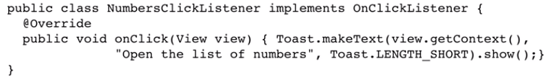
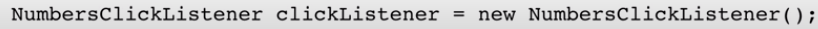
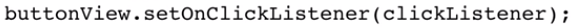

# 13. How to setup an event listener
Created Monday 23 November 2020

Follow these steps:

1. Define the event listener and it's behavior. Use any of the two ways we've seen before.

2. Create the reference object using its constructor.

3. Attach the clickListener. This is done by passing the reference object to the setOnClickListener

*****

* There's a better way(a one liner), where we don't need to create another class. We can make an anonymous class implementing View.onClickListener

