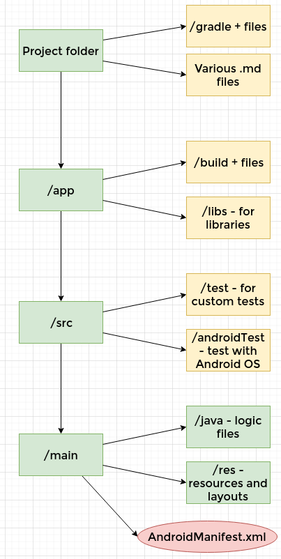
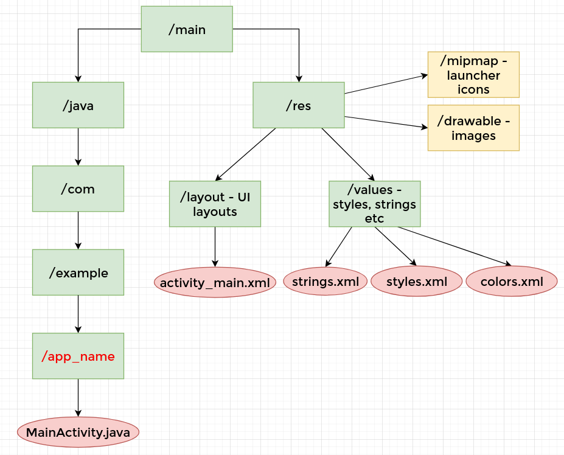

# 2. Android app directory structure
Created Thursday 19 November 2020

The directory structure for an Android app is as follows:
**Basic Structure**

*****

**Core App structure**

*****

More resources

* [./android_structure.drawio](./2._Android_app_directory_structure/android_structure.drawio)
* [Important Files in an Android App, GfG](https://www.geeksforgeeks.org/android-android-apps-file-structure/#:~:text=layout%3A A layout defines the,are written in XML language.&text=mipmap%3A Mipmap folder contains the,used in Android Studio application).

