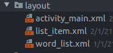

# 10. Completing changes for all sections
Created Friday 01 January 2021

We have the following files:

1. *Word*
2. *WordAdapter*
3. *activity_numbers.xml* with a ``ListView``
4. list_item.xml

Out of these, no. 3 is specific to the NumbersActivity, only due to the ``tools:context="NumbersActivity"`` which is not really important as the activity_numbers.xml has nothing specific to numbers in it because all the words are added to the list dynamically when the app is running via Java code.

So instead of having 4 different layouts, i.e *activity_numbers*, *activity_phrases* etc, we can have a single layout file called *word_list.xml*.

I've also deleted all the activity_<verb> files. Now there are only three layout files.

