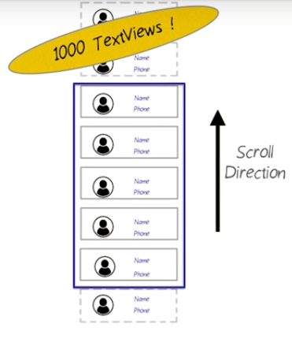
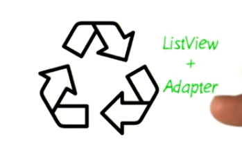

# 3. Memory is Limited
Created Wednesday 25 November 2020

* This is particularly important for views.
* Suppose in a 'contacts' app, we have the following:

* Notice that only 5 contacts are visible at any time. 
* We can have only five views, whose contents is changed. This way we save a huge amount of memory.
* This is what the (ListView+Adapter) pattern does.

