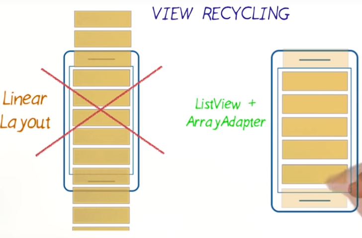
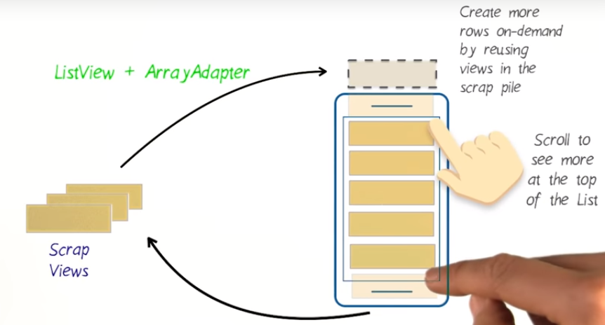
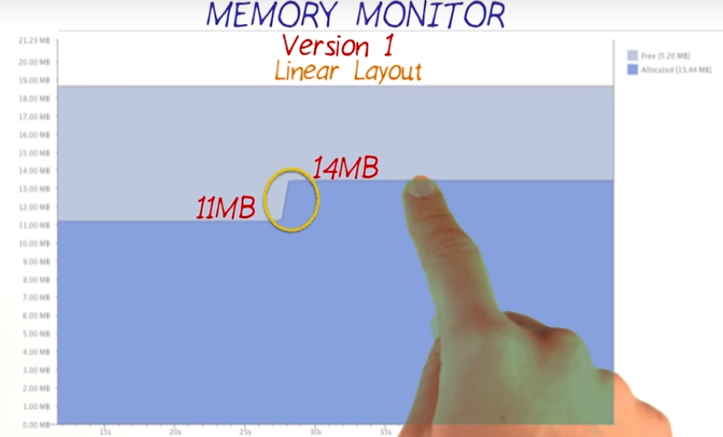
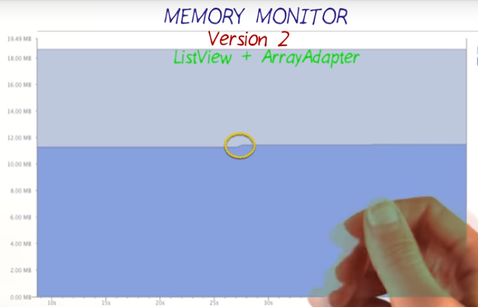

# 4. View Recycling
Created Wednesday 25 November 2020

* View Recycling - using Views that are no longer visible on the screen.
* In Instagram, we do have an infinite(new view are being added everytime) number of stories.
* If we create new views for each story, we'll run out of memory very quickly.

* Using the ListView and ArrayAdapter, we create only the views that are visible on the screen. i.e If we scroll upwards, we don't need to see the views at the bottom.

*****

* Recyling actually refers to changing the data of views.

*****

#### Memory usage - comparison
 

