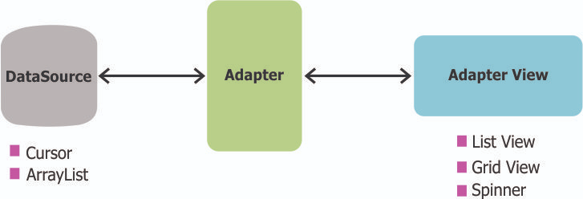
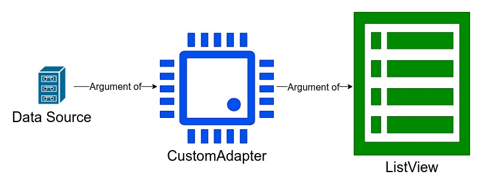
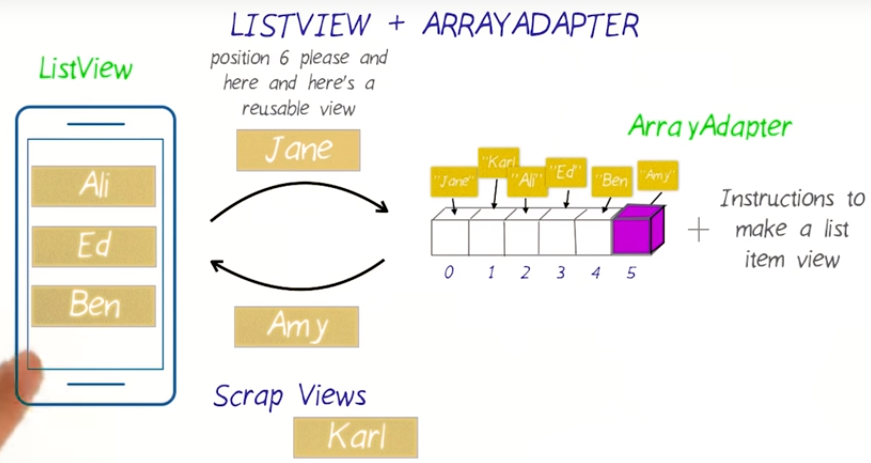
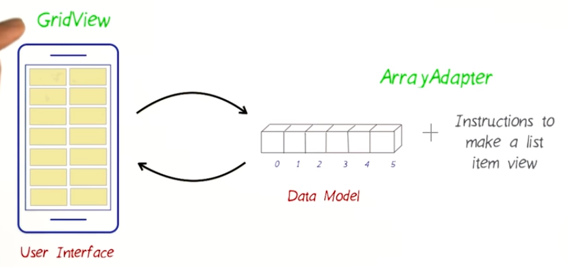
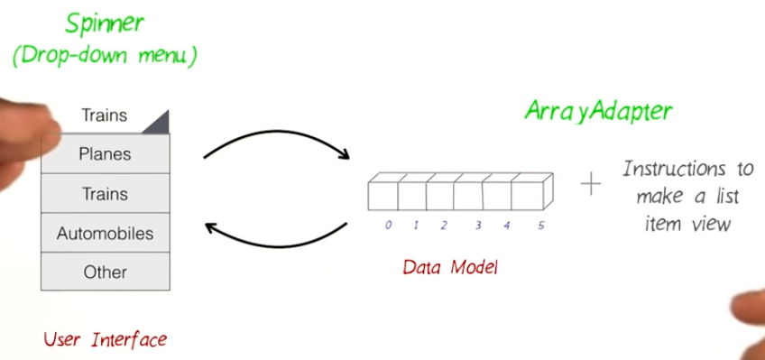

# 6. ListView and Array Adapter
Created Wednesday 16 December 2020

DS - Data Source/Structure

There are 3 components involved here:

1. ``ArrayList`` - a DS containing the data to be displayed.
2. **CustomAdapter** extends ``ArrayAdapter`` - a generic class(type same as DS) which provides instructions about how to recycle and display elements from the DS. The DS is a data member for this class.
3. ``ListView`` - an XML view that renders the smart list. Takes as argument a **CustomAdapter** object.

The interaction is like this:

Code is just a mirror of the interaction:

#### How does ListView+Adapter works
Requisite

* We pass the DS as argument to a customAdapter(which inherits from the ArrayAdapter class). We also code instructions on how to manipulate and create ListItemView(s) inside the ListView.
* ListView object is created and a customAdapter object is passed to it.

1. When we associate the ``customAdapter`` to the ListView, the ListView asks the number of views that will be displayed. The adapter answers and creates a pile of views.
2. The ListView then requests for views at some index to display, following which the adapter substitutes relevant content and passes the itemview to the ListView.
3. When the screen is full and the user scrolls, the ListView gives the next position(index) that the user wants. The adapter recycles old views and passes them over to the ListView to display at a comfortable index(i.e 0 to length of ListView).

Note:

* ListView is a dumb component, it just displays stuff the customAdapter tells it to. Think of the arrayAdapter as the powerhouse of the whole process.
* ListView does not interact directly with the Data structure, this reduces coupling which is good.
* The ListView handles simple indices from 0 to length_of_layout - 1. While the ArrayAdapter handles relatively complicated indices within the array.
* ArrayAdapter is one of the simplest adapter, it is not the only one. We can change it for say, a GridView or a Spinner.

##### Adapter pattern is used abundantly in Android apps, understanding it is critical. Its idea is trivial, we are just saving space.

