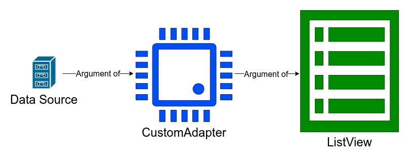
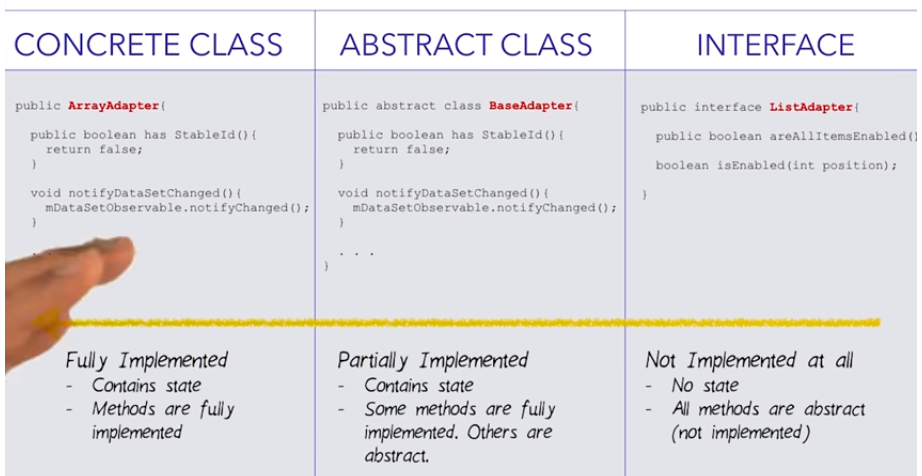

# 7. Code for ListView and ArrayAdapter
Created Sunday 20 December 2020

Code is something like this.

The adapter needs two things:

1. DS
2. A resource(view) which it creates, recycles and passes on to the ListView.

We'll be using a built-in resource named ``android.R.layout.simple_list_item_1`` here. Alternatively, we could have created our own listitem_view layout in an XML file.

The listview needs one thing only.

1. An adapter.

Include the listview in XML

Finally, we have
	// DS
	String[] numbers = {"one", "two", "three", "four", "five", "six", "seven", "eight", "nine", "ten"};
	
	// constructor - context, listitem_view_resource, content array
	// we are using a concrete adapter here.
	ArrayAdapter<String> arrayAdapter = new ArrayAdapter<>(this, R.layout.listitem_view, numbers);
	
	// Create the listView from 
	ListView lv = (ListView) findViewById(R.id.list_view);
	
	// pass the ListView the array adapter
	lv.setAdapter(arrayAdapter);

*****

Android has the following code for adapters.

* ArrayAdapter is the simplest - it is concrete.
* BaseAdapter is partially implemented.
* ListAdapter needs to be implemented from scratch.

Check [this](https://github.com/codepath/android_guides/wiki/Using-an-ArrayAdapter-with-ListView) out.

