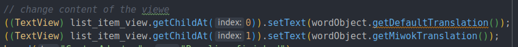
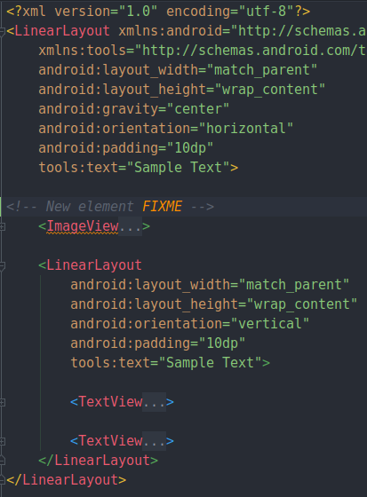

# zConclusion
Created Saturday 02 January 2021

#### An example of bad design
Suppose this is out root view

We write code which accesses the children

Now, suppose we change the layout file to to this.

The code just doesn't work.

**Why did this happen?**
This happened because we assumed views would never change, which is a bad assumption. This caused our code to be tightly coupled.

**What's a correct way then?**
Use ids. But keep in mind that ids usually couple code more. In this case the code was even more coupled.

