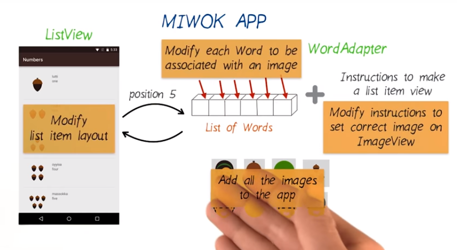

# 2. Scoping out work for a new feature
Created Sunday 03 January 2021

We have come to a point which is common for developers. We have the app working and we get a  feature request.

A dev has to decide the following things:

1. Design of the changes.
2. Determine the scope of the work:
	1. Changes in the codebase.
	2. Time taken to implement the feature.

* Having a rough(but complete) mental model of the app helps in deciding these things.

*****

How to implement changes:

1. As each cell is changing, we'll need to create custom classes for each type of data.
2. We will need to  list_item.xml files.
3. We also have to create relevant adapters, which handle the custom classes.
4. We need to change the relevant sections Java code.

