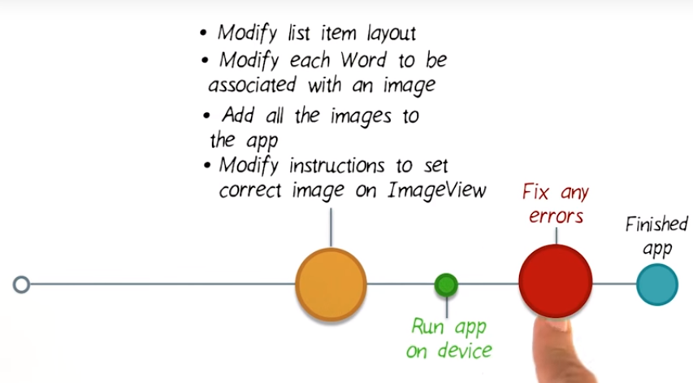
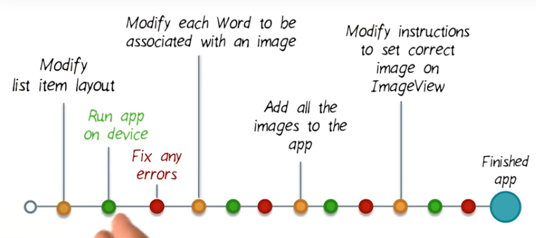

# 3. What Order to make changes in
Created Sunday 03 January 2021

#### Rate of change
There are two major ways to implement a feature:

1. Make all changes, then see if the app runs. This method has a high probability of failure because it'll be difficult to pinpoint the error.

2. Make small incremental changes and keep checking if they work. Note that here, we may spend some extra time running an incomplete feature but is is very less when compared to debugging multiple files at many different places.

**Note**

* **The incremental method is better. **
* **Although if the feature is very small or straightforward, we can skip to the quicker one. **
* **In large codebases, the incremental method is better in the long run.**

#### Order of change
In what order should we make the changes? There are many strategies, like:

1. **Do the riskiest(difficult) first **- This helps us keep a contigency plan, i.e we can change our design if things don't work out. It also reduces coupling in the code, which would have been significant if we had done simple things first.
2. **Implement what you can based on available data** - It would be stupid to wait for the designers to give us final images, sound etc. We can work with good **stubs** aka placeholder or dummy data. This saves development cost, time and also makes us aware of the variations that are possible with the data, as stubs are not at all final.

*****

17. In what should we make the [changes](./2._Scoping_out_work_for_a_new_feature.md)?
18. Based on the data availability and risk, the following order seems good:
	1. Modify the ``list_item`` layout.
	2. Add the images, stubs or otherwise.
	3. Modify the ``Word`` class to include image data as per the ``list_item``.
	4. Modify the ``WordAdapter`` to work with the changes in ``Word`` class and ``list_item`` layout.

